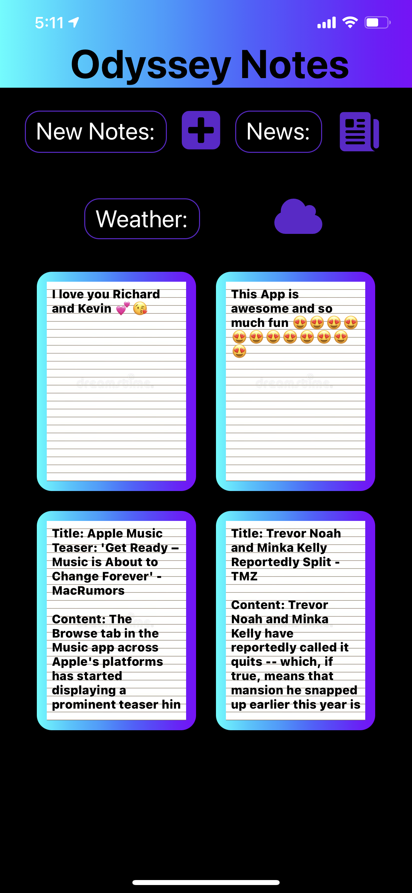
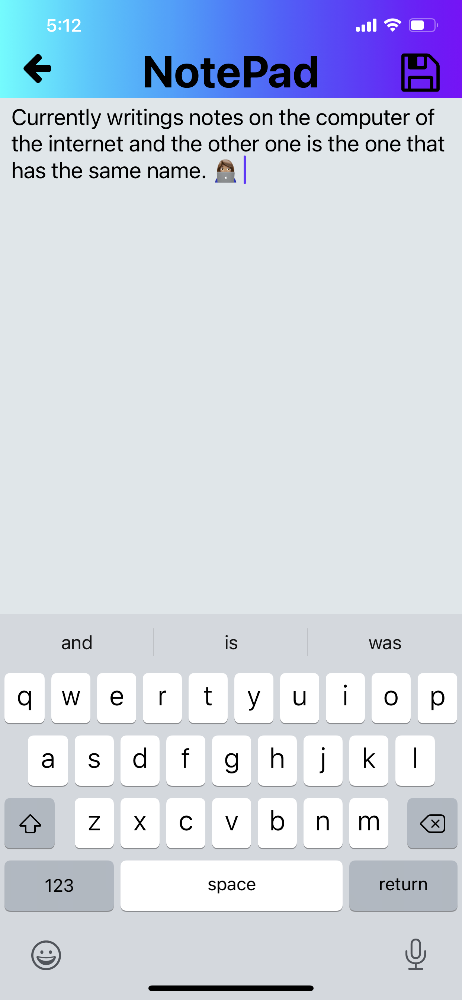
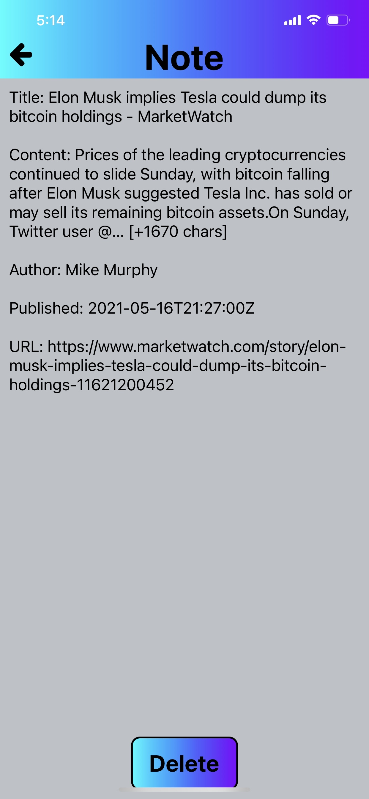
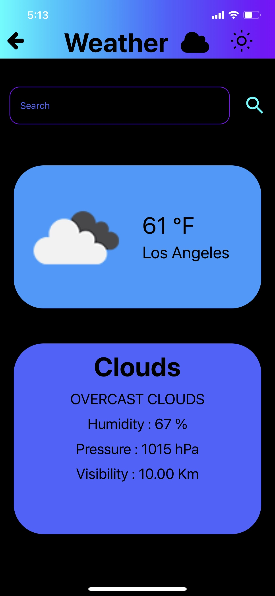
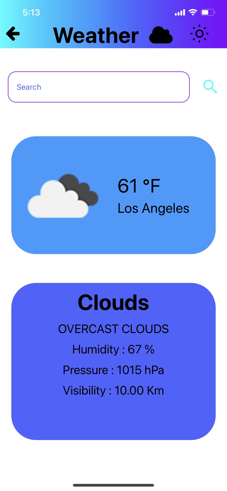

# Odyssey Notes :memo:
:pencil:

# Authors :boy: :boy: :girl:
* [Heriberto Gonzalez](https://github.com/gonzo-32/) :smiling_imp:
* [Carlos Mendoza](https://github.com/cmendo67) :ghost:
* [Yara Ajjawi](https://github.com/yara-code) :heart_decoration:

Our Notes App is called Odyssey Notes. You are able to create a note and be able to delete a note. Odyssey notes app has two other features. You can check the weather and you can search a city or country to check the weather. Not only that but odyssey notes app also has a feature that allows you to check the current news. You have a list of news displayed to you and you can click on a particular news and save that particular news to your notes app and it will display it in the list of all your notes in the main page of the app.

## Main Screen/ Main Page: :house:

Odyssey Notes is displayed as the title on top and there are three icons below the title that say New Notes, News , and Weather. Below those Icons, a list of notes should appear there and if you don’t have any notes then nothing should appear below the icons.

## New Notes Icon: :heavy_plus_sign:

When you click on New Notes Icon it will take you to the NotePad page. The title of that page is NotePad. In that page you start to write anything you want and once you finished writing your notes. To save it, you have to click on the save Icon on the top right of NotePad page. Once you click that save Icon it will take you back to the main page and it will display the note that you have just created.

## News Icon: :newspaper:

When you click on News Icon it will take you to the News page. The title of that page is World News. In that page a list of news articles are listed to you and if you click on one specifically then it will show more details based on that news article.
When you click on a news article there are three buttons displayed to you: close, save, full article. When you click on close, then it will close that news article and it takes you back to the World News page.
When you click on Save then the contents of that news article is saved as a note for you and is listed in the rest of the notes list in the main page.
When you click on Full Article it will take you to the actual URL page of that particle news article that you clicked on. That URL that you are taken to will display the full article to you.When you are on the World News page there is a arrow on top left and if you click on it then it will take you back to the main page of the odyssey notes app.

## Weather Icon: :sunny: :cloud: :cloud_with_lightning_and_rain: :snowflake:

When you click on Weather Icon it will take you to the Weather page. The title of that page is Weather. In that page the weather of a particular city or country is shown with the name of the city or country with the temperature. Not only that but it also displays Humidity, Pressure, and visibuility.
There is also text input for search. That search allows you to search for a city or country to check weather and as you can see, there is search Icon next to it. You have to click on that search Icon in order to search. Once you click on it it will display the new weather of that city/country that you searched for.
Not only that but on the top right there is a brightness Icon and if you click on that then Weather page will be in light mode. Instead of the page being black it will be white now. If you click it again it turns the screen to dark mode and the screen will be black
There is a arrow on the top left and if you click on it, it will take you back to the main page.

## Deleting a Note: :heavy_multiplication_x:

For example, lets say you have a list of notes listed in the main page. To delete a note all you have to do is to click on a particular note and it will take you to the Note page. Note page has a delete button and if you click on that delete button it will delete the note and it will take you back to the main page. If you don’t click on delete , in order for you to go back to the main page, click on the arrow that is shown on the top left.

## This is the functionality of Odyssey Notes App.

- https://expo.io/@cmendo67/projects/odyssey-notes

* https://expo.io/@gonzo-32/projects/odyssey-notes

| | | | |
|:-------------------------:|:-------------------------:|:-------------------------:|:-------------------------:|
|  Odyssey Notes |  Writing Notes | Reading Note | Full Article
|  News Preview | World News | Weather: Dark Mode | Weather: Light Mode  
